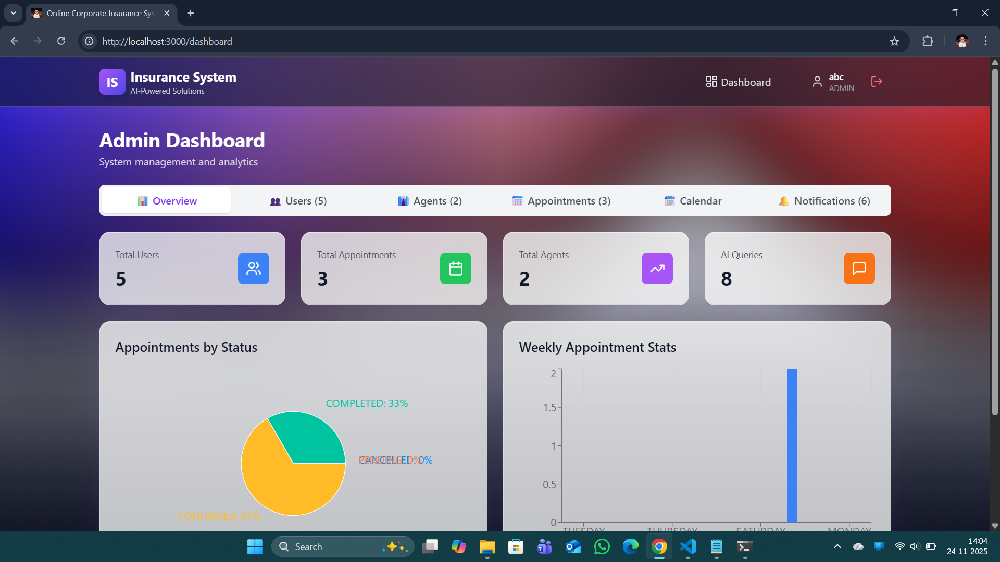
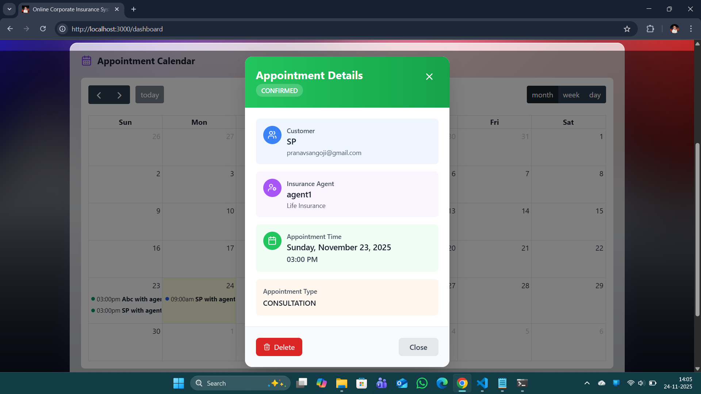
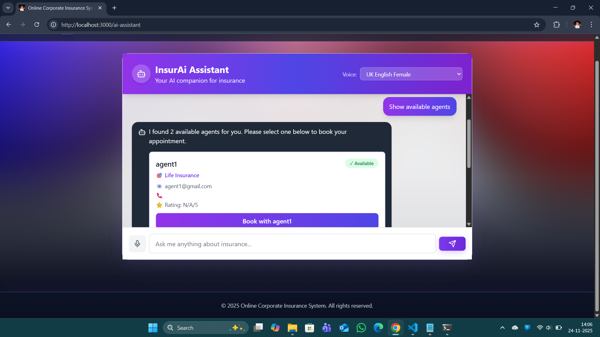
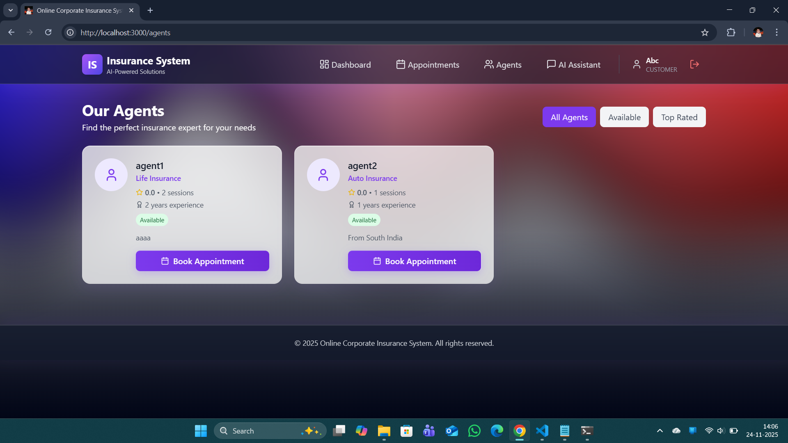
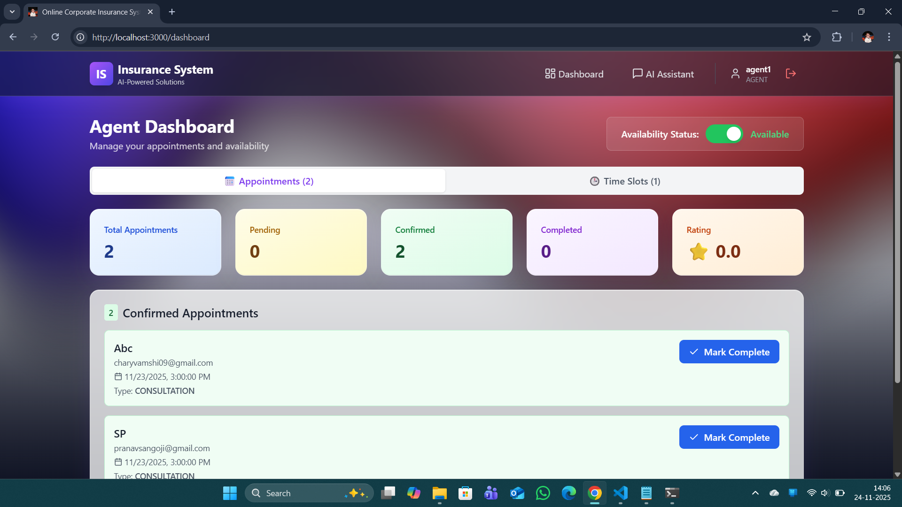
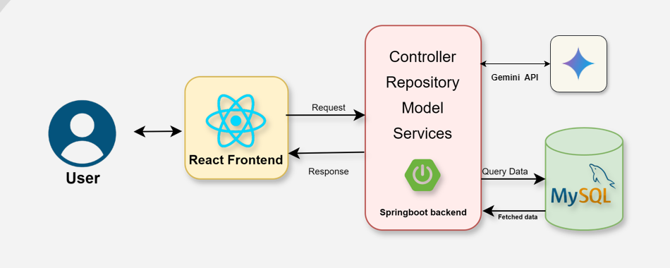

# Group C

## GitHub Collaborator Status

| S.No | Name                      | Status                                         |
| ---- | ------------------------- | ---------------------------------------------- |
| 1    | Sangoji Pranav            | joined                                         |
| 2    | Rakesh Kummari            | joined                                         |
| 3    | MURABOYINA HARSHINI PRIYA | joined                                         |
| 4    | Mithunraj M               | joined                                         |

#### **Mentor:** Niti-Dwivedi — Invitation sent

# 🎯 Project Overview

A comprehensive AI-powered online insurance management system built with **React**, **Spring Boot**, **MySQL**, and **Google Gemini AI**. This MVP enables customers to manage insurance policies, schedule appointments with agents, and get instant answers using voice-enabled AI assistance.

---
## Deployed Url: https://deepuchary-insurai.vercel.app/
---
# Screenshots

  
 

---

## ✨ Features

### 👥 **Customer Features**

- ✅ User registration and JWT-based authentication
- ✅ Browse available insurance agents
- ✅ Schedule appointments with agents
- ✅ AI-powered insurance query assistant (voice + text)
- ✅ View and manage appointments
- ✅ View insurance policies
- ✅ Email notifications for appointments

### 🤝 **Agent Features**

- ✅ Agent profile management
- ✅ Set and manage availability slots (CRUD)
- ✅ View incoming appointments
- ✅ Confirm/cancel appointments
- ✅ Track appointment statistics

### 🔐 **Admin Features**

- ✅ Comprehensive analytics dashboard
- ✅ Monthly appointment calendar (FullCalendar.js)
- ✅ Pie chart: Appointment distribution by status/type
- ✅ Bar chart: Weekly/monthly appointment trends
- ✅ AI query analytics
- ✅ User, agent, and appointment management

---

